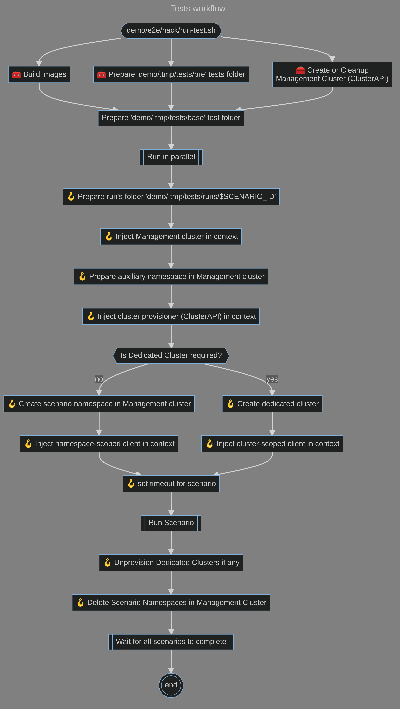

# 🎙 MC Test

In this repo you find some code that may be useful when using [godog](https://github.com/cucumber/godog) in a multi-cluster environment.

Have a look at the content of the [demo](./demo) folder for an example.

## Behaviour-driven development (BDD)

Behavior-driven development (BDD) is a software development process that encourages teams to use conversation and concrete examples to formalize a shared understanding of how the application should behave.

### Ginkgo

[Ginkgo](https://github.com/onsi/ginkgo) is a mature testing framework for Go designed to help you write expressive specs.
Ginkgo builds on top of Go's testing foundation and is complemented by the Gomega matcher library.
Together, Ginkgo and Gomega let you express the intent behind your specs clearly.

### Gherkin

Using [Gherkin](https://cucumber.io/docs/gherkin/reference/) it possible to define feature files with all your stakeholders using Behavior-Driven Development (BDD).
Automatically create documentation that’s up to date and easily shareable.

```
Feature: Guess the word

  Scenario: Maker starts a game
    When the Maker starts a game
    Then the Maker waits for a Breaker to join

  Scenario: Breaker joins a game
    Given the Maker has started a game with the word "silky"
    When the Breaker joins the Maker's game
    Then the Breaker must guess a word with 5 characters
```

### Godog

[Godog](https://github.com/cucumber/godog) is the official Cucumber BDD framework for Golang, it merges specification and test documentation into one cohesive whole, using Gherkin formatted scenarios in the format of Given, When, Then.

## ClusterAPI

[Cluster API](https://cluster-api.sigs.k8s.io/) is a Kubernetes sub-project focused on providing declarative APIs and tooling to simplify provisioning, upgrading, and operating multiple Kubernetes clusters.

## What's in this repo

### pkg

In the [pkg](./pkg) folder you find features that can be used setting up BDD tests in a kubernetes multi-cluster environment.

* [context](./pkg/context): helper functions to inject data into and retrieve data from a `context.Context`
* [infra](./pkg/infra): abstractions to provision/unprovision clusters with Cluster API
* [kube](./pkg/kube): clients and utilities to interact with a kubernetes cluster
* [poll](./pkg/poll): helper functions to poll until a condition is met
* [testrun](./pkg/testrun): helpers to create and manage a per test-run folders to avoid changes to source file to break runs isolation

### demo

In the [demo](./demo) folder you find an example of BDD tests for a multi-cluster scenario

The following workflow is implemented:




## References

* https://en.wikipedia.org/wiki/Behavior-driven_development
* https://github.com/onsi/ginkgo
* https://cucumber.io/
* https://cucumber.io/docs/gherkin/reference/
* https://github.com/cucumber/godog
* https://cluster-api.sigs.k8s.io/
