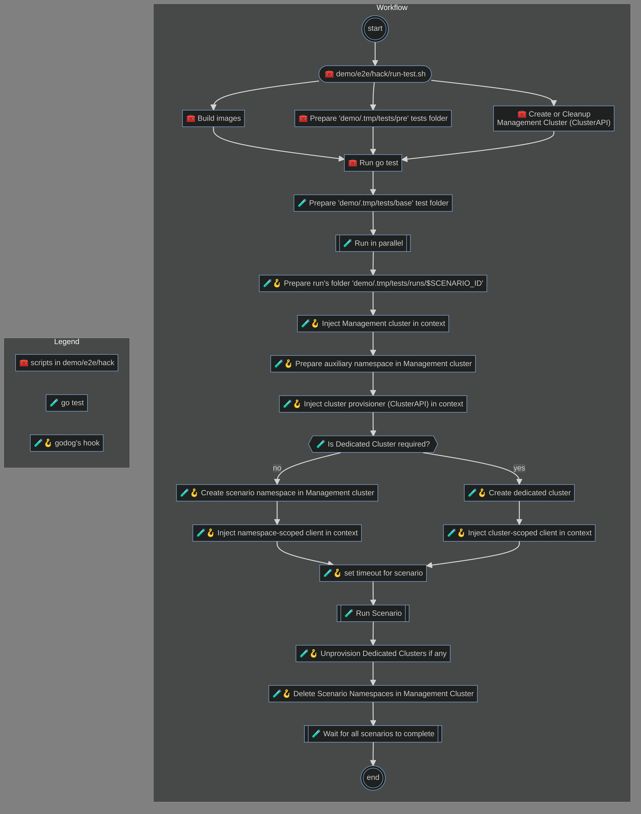

# 🎙 MC Test

In this repo you find some code that may be useful when using [godog](https://github.com/cucumber/godog) in a multi-cluster environment.

Have a look at the content of the [demo](./demo) folder for an example.

## Demo

In the demo the following workflow is implemented:

